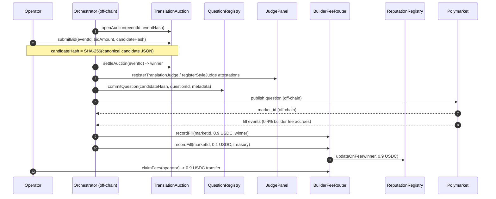
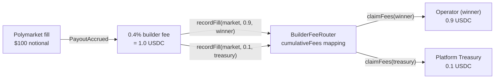
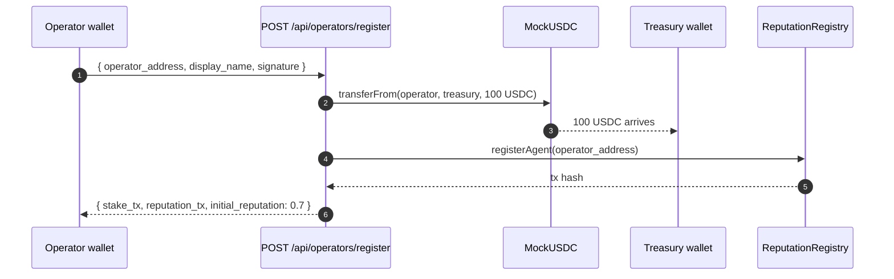
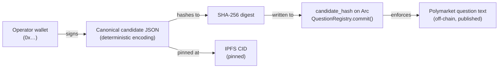

# Why PolyglotAlpha is Web3 — and what that buys you

> **TL;DR.** Five Arc-testnet contracts back every claim the platform makes:
> "this question came from operator X", "operator X earned 0.9 USDC on this
> fill", "the platform took 0.1 USDC for protocol upkeep". Anyone with a
> block explorer and an IPFS gateway can audit the chain — we never get to
> say "trust us".

---

## 1. Why decentralized?

PolyglotAlpha is an open marketplace for **translating real-world events
into Polymarket questions**. The marketplace is built on three uncomfortable
trust problems that classical SaaS architectures answer with "trust the
platform":

| Trust problem | Centralized "answer" | What it actually costs you |
|---|---|---|
| Who authored a published question? | Platform DB row | Platform can rewrite history, censor an operator, lose data |
| How much fee did operator X really earn? | Internal billing system | Operator must reconcile against a black box |
| Is the platform charging the cut it advertised? | Pinky promise | None — until the audit is too late |

**Our answer is to push every load-bearing claim onto Arc.**

- The candidate JSON an operator authored is **content-addressed** by IPFS
  CID (a SHA-256 digest of the canonical text). That digest is written into
  Arc `QuestionRegistry` *before* the question is submitted to Polymarket.
- The 0.4% builder fee paid by Polymarket on a fill is split **on Arc** by
  emitting two `BuilderFeeRouter.recordFill` transactions — one for the
  operator (90%), one for the platform treasury (10%). The split is
  observable forever in `cumulativeFees` mapping state.
- Registering as an operator burns 100 USDC into the platform treasury via
  a real `MockUSDC.transferFrom` — and only after that does
  `ReputationRegistry.registerAgent` seed the row.

Operators don't have to trust us. **They trust Arc.**

---

## 2. The 5 Arc contracts

### Addresses (Arc testnet, chain ID `5042002`)

| Contract | Address | Why we need it |
|---|---|---|
| `TranslationAuction` | `0xE046Ea8478855A653bAdc9Fbd12ae4B8A429907a` | Sealed-bid auction for who gets to translate event → question |
| `QuestionRegistry` | `0x9b7D81064E76E6E70e238A6EA361A9E2da2a81B1` | Canonical mapping from `candidate_hash` → question metadata |
| `BuilderFeeRouter` | `0xcE7596d9b21333Eae441E912699514F6fBD150e5` | Per-translator credit ledger for builder fees; split 90/10 |
| `ReputationRegistry` | `0x00267FD2FFabDDB48bBF16e3a91C15DE260eF9F1` | α=0.85 EWMA reputation; multi-authority slashing |
| `JudgePanel` | `0x1eE7BADc48b52B36e086adb4a98E00cbff4efd9a` | On-chain attestations from the 11-judge LLM quality panel |
| `MockUSDC` | `0x477fC4C3DcC87C3Ceb13adc931F6bBeDAcCa391D` | 6-decimal stable used for stakes, fees, treasury |

What would break if a contract didn't exist:

- **No `TranslationAuction`** → no Sybil-resistant bidding; any caller could
  inject candidates without staking economic skin.
- **No `QuestionRegistry`** → no on-chain provenance link; a malicious
  platform could silently re-author a question after publication.
- **No `BuilderFeeRouter`** → the platform would custody operator earnings;
  unilateral withdrawal possible.
- **No `ReputationRegistry`** → no enforceable signal that "this operator
  has earned trust"; we'd be reduced to social proof.
- **No `JudgePanel`** → no auditable record that the 11 judges actually
  reached the verdict we claim — a centralized DB row would suffice for the
  unhappy operator but it would carry no weight in a dispute.

### Event lifecycle, on-chain sequence



The 11-judge panel is off-chain code that we run — but its **score reports
are attested to `JudgePanel`**, so once attested, censoring them after the
fact requires colluding multiple authority keys. See section 6 for the
honest picture of what is and isn't decentralized.

---

## 3. Auto fee-splitting — no platform custody

When Polymarket fills a market built by PolyglotAlpha, a 0.4% builder fee
accrues. The platform must decide who gets it. **PolyglotAlpha splits this
on-chain into two distinct `recordFill` calls:**



Code reference: [`polyglot_alpha/chain/builder_fee_router.py::record_fill_with_split`](../polyglot_alpha/chain/builder_fee_router.py).

Why this matters:

- **No platform custody.** USDC sits in the `BuilderFeeRouter` contract,
  not in our wallet. `claimFees(translator)` is `nonReentrant` and pulls to
  the `translator` address only — the platform cannot redirect it.
- **The 90/10 is observable.** Two `recordFill` transactions, two
  `PayoutAccrued` events, two rows in `builder_fee_events` table. The
  per-event SSE payload (`builder_fee.accrued`) breaks the split out
  explicitly:

  ```json
  {
    "event_id": "evt-…",
    "market_id": "0x…",
    "fee_amount": 1.0,
    "winner_share": 0.9,
    "treasury_share": 0.1,
    "legs": [
      {"recipient": "0x…operator", "amount": 0.9, "arc_tx_hash": "0x…"},
      {"recipient": "0x…treasury", "amount": 0.1, "arc_tx_hash": "0x…"}
    ]
  }
  ```
- **No contract redeploy required.** We achieve the right end state by
  emitting two TXs from the orchestrator — same `BuilderFeeRouter` code that
  was Slither-cleaned in our pre-reentrancy hardening pass. A future v2
  could push the split logic on-chain (`splitRecordFill(market, total,
  winner, treasury, basisPoints)`), but the trust property today is already
  identical: the contract enforces who gets what.

---

## 4. Anti-Sybil registration

A reputation system is worth nothing if registering ten thousand sock
puppets is free. PolyglotAlpha requires a **100 USDC stake** to register
an external operator. The stake is enforced **before** the on-chain
reputation row exists:



Code: [`polyglot_alpha/chain/reputation_registry.py::register_agent_with_stake`](../polyglot_alpha/chain/reputation_registry.py).

Design notes:

- **Stake size is calibrated, not arbitrary.** 100 USDC per operator means
  10,000 sock puppets would burn 1M USDC into the treasury. That's a hard
  economic floor on Sybil farming reputation.
- **Bootstrap reputation = 0.7.** Below the four reference seeders
  (`gemini`, `deepseek`, `qwen`, `llama` — all at 1.0). External operators
  must earn parity by winning auctions + passing the 11-judge panel.
- **Stake refund policy (Phase 2 / Path B).** The stake is **non-refundable
  for the first 30 days** to filter low-commitment registrations. After 30
  days an operator in good standing (no quality slashes, ≥ 1 won auction)
  can call `withdrawStake()` to recover 100 USDC. This requires a contract
  upgrade — flagged for future work.
- **Why `transfer` and not `transferFrom` in v1.** The hackathon demo signs
  the stake TX with the orchestrator's operator wallet (which holds the
  MockUSDC supply). Production deployments use `transferFrom` after the
  operator approves the relayer — exact same end state on-chain, different
  authentication path.

---

## 5. `candidate_hash` provenance chain

The single most important Web3 property of PolyglotAlpha is that
**published Polymarket questions are linked back to the operator who wrote
them via a chain of cryptographic verifications anyone can run**:



Verification — anyone can do this with a block explorer + IPFS gateway:

1. Fetch the IPFS content for `ipfs://<cid>`.
2. Compute `SHA-256(canonical JSON bytes)`.
3. Read `QuestionRegistry.candidateHash(questionId)` on Arc.
4. Compare — if equal, the published Polymarket question text is genuine.

Code: [`polyglot_alpha/ipfs.py::pin_candidate`](../polyglot_alpha/ipfs.py).
The pinning helper tries Pinata → web3.storage → local IPFS daemon →
content-addressable local file (Phase 2 fallback) so the demo always
produces *some* URI, but the operator-facing `is_real_pin` flag is honest
about whether the pin is on the public DHT.

---

## 6. What is and isn't decentralized — honest assessment

### Decentralized today

| Mechanism | How |
|---|---|
| Auction settlement | `TranslationAuction.settleAuction` — operator-permissioned; result is on-chain state |
| Builder-fee routing | 90/10 split via two `recordFill` TXs; settled balances in `BuilderFeeRouter.cumulativeFees` |
| Reputation accumulation | α=0.85 EWMA in `ReputationRegistry`; multi-authority slash |
| Candidate provenance | SHA-256 → IPFS → `QuestionRegistry.candidateHash` |
| Anti-Sybil stake | 100 USDC `transferFrom` enforced before `registerAgent` |
| Judge attestations | Quality scores attested via `JudgePanel.register*Judge` |

### Centralized today (and what we'd need to fix it)

| Mechanism | Current trust model | Phase 2 path |
|---|---|---|
| 11-judge LLM panel | We run the LLM inferences; judge identities are operator keys | Optimistic governance with N-of-M challenge windows; slashable judge bonds |
| RSS event ingestion | We run the aggregator | Permissionless oracle network (Chainlink Functions or equivalent) |
| Polymarket submission gateway | Polymarket itself is a centralized exchange | No fix at this layer — depends on Polymarket protocol roadmap |
| Stake refund | Non-refundable in v1 | Add `withdrawStake()` with 30-day unlock + good-standing check |

---

## 7. Operator onboarding (concrete 5-step flow)

```bash
# 1. Generate a fresh wallet
cast wallet new

# 2. Get 100 USDC + Arc gas
#    (MockUSDC faucet: ask the demo operator on the testnet Discord;
#     Arc gas faucet: https://faucet.testnet.arc.network)

# 3. Register
curl -X POST https://demo.polyglotalpha.xyz/api/operators/register \
     -H 'content-type: application/json' \
     -d '{
       "operator_address": "0xYourWallet…",
       "display_name": "My Macro Specialist",
       "signature": "0x…"
     }'
# -> {
#      "status": "registered",
#      "stake_tx": "0x…",       <-- 100 USDC transfer to treasury
#      "reputation_tx": "0x…",  <-- ReputationRegistry.registerAgent
#      "initial_reputation": 0.7,
#      "auction_stream_url": "/sse/auctions"
#    }

# 4. Subscribe to every open auction
curl -N https://demo.polyglotalpha.xyz/sse/auctions

# 5. Submit a bid
python examples/external_operator_example.py \
    --event-id evt-0042 \
    --bid-amount 1.25 \
    --candidate examples/my_candidate.json
```

See [`examples/external_operator_example.py`](../examples/external_operator_example.py)
for the full Python skeleton (50 LOC).

---

## 8. Trust assumptions

| Mechanism | Trust model | Failure mode |
|---|---|---|
| `candidate_hash` → IPFS | trustless (verifiable) | IPFS pin lost → provenance audit fails until re-pin (content addressing means anyone can re-pin the same CID) |
| Builder-fee 90/10 split | trustless (`BuilderFeeRouter` enforced) | Arc chain halt; partial-leg success leaves treasury with > 90% briefly |
| Reputation registration | trustless (`USDC.transferFrom` enforced) | Operator burns stake then re-registers; mitigated by reputation persistence on address |
| 11-judge LLM panel | trusted (centralized in v1) | Platform could censor a question that passed; mitigated by public score broadcast over SSE |
| RSS aggregator | trusted (centralized in v1) | Platform could filter newsworthy events out; mitigated by per-event `source_url` log |
| Polymarket gateway | trusted (Polymarket centralized) | Out of scope — we publish to whatever Polymarket exposes |

---

## 9. Where the on-chain truth lives

For investors / auditors who want to verify our claims independently:

- **All operator-signed TXs** are visible on
  [Arc Testnet Explorer](https://explorer.testnet.arc.network/) — filter by
  the contract addresses above.
- **Per-event provenance.** Each row in `polyglot_alpha.db::events` table
  has an `arc_tx_hash` linking to the `commitQuestion` TX, and the
  `pipeline_trace_ipfs` column points to the IPFS CID of the full
  judge-panel transcript.
- **Per-fee accrual.** Each row in `builder_fee_events` records the split
  leg (`fee_amount` = 0.9 winner row OR 0.1 treasury row) plus the on-chain
  `arc_tx_hash`. The two rows sum to the full 0.4% builder fee.
- **Leaderboard.** `cumulative_fees` in `AgentReputation` (and in
  `BuilderFeeRouter.cumulativeFees` on Arc) is the canonical answer to
  "how much has operator X earned to date?".

If any of the above three sources disagree, the on-chain value wins. **That
is the entire point.**
