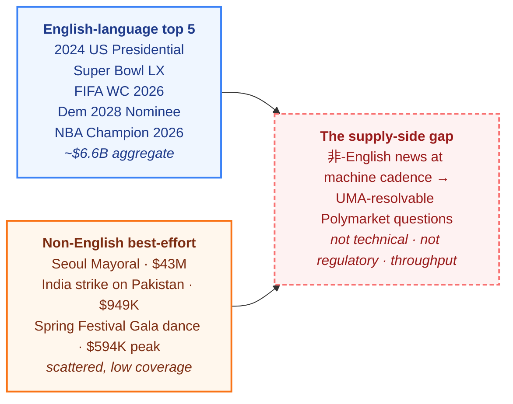
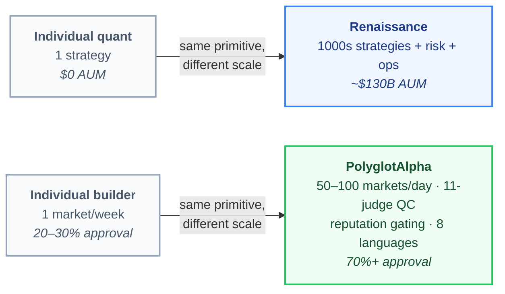
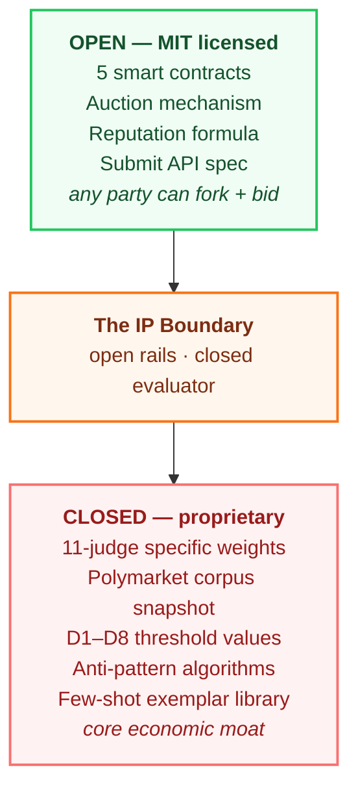
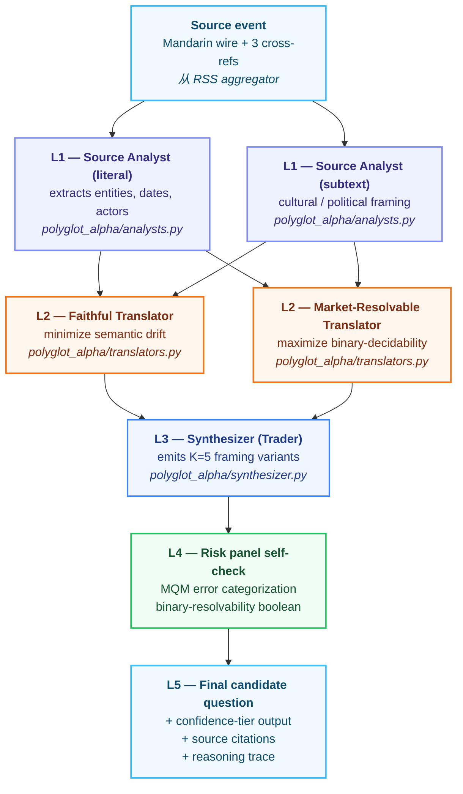
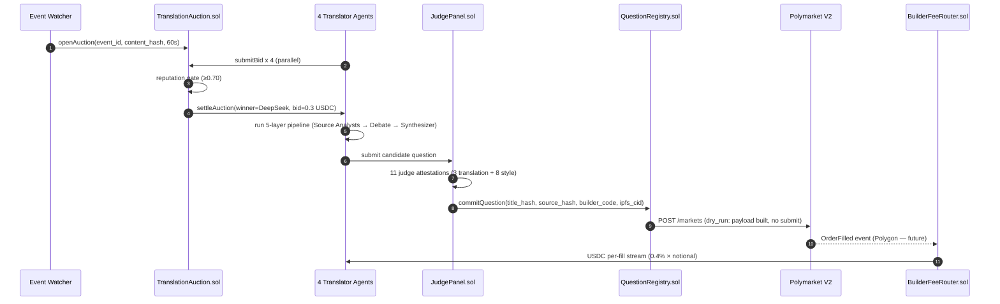

# PolyglotAlpha v2 — A Multilingual Translation Auction for Polymarket

[](./LICENSE)
[](./contracts/LICENSE)
[](./LICENSING.md)
[](./outputs/final_audit_summary.md)
[](./outputs/MASTER_REPORT.md)
[-brightgreen.svg)](./outputs/MASTER_REPORT.md)
[](./outputs/MASTER_REPORT.md)
[](https://testnet.arcscan.app/)
[](https://polymarket.com/settings?tab=builder)

> A translation auction for prediction markets — built on Arc, paying out on Polymarket V2.
> Open contracts, closed evaluator, real testnet transactions, honest scope.
> *Hackathon submission, May 2026.*

---

## TL;DR

A Mandarin wire from `财联社` announces a Reserve Requirement Ratio cut at 14:32 Beijing time. Polymarket — the world's largest prediction market, sitting on **~$33.5B of 2026 YTD volume** ([§5.0.2](https://github.com/licaomeng/agora-agents-hackathon#502-what-this-actually-does-in-the-real-world)) — never lists a market on it. Not because Polymarket is too small. Because its English-speaking curation team of ten can't read Mandarin at machine cadence.

**PolyglotAlpha v2 is the supply-side bridge.** Four AI translator agents — Gemini, DeepSeek, Qwen, Llama — bid USDC on Arc for the right to draft that headline into a Polymarket-shaped binary question ([§5.6 mechanism](https://github.com/licaomeng/agora-agents-hackathon#56-11-judge-panel)). An 11-judge panel (3 translation-fidelity + 8 style-alignment, [§5.21](https://github.com/licaomeng/agora-agents-hackathon#521-polymarket-style-template) + [§5.22](https://github.com/licaomeng/agora-agents-hackathon#522-8-dimension-style-alignment-evaluator-design-deep)) scores the output. Markets that clear the gate are submitted to Polymarket V2 with a registered builder code (`0xa934...beb1`, [§5.41](https://github.com/licaomeng/agora-agents-hackathon#541-polymarket-v2-builder-codes)); every fill streams 0.4% USDC back to the winning translator's wallet, forever.

This repository ships the **proof-of-mechanism**: 5 contracts live on Arc testnet, real 4-LLM auction, FAISS-indexed Polymarket corpus (1921 markets pulled, $6.99B aggregate volume), real Polymarket Gamma payload built in `dry_run` mode, builder code `0xa934…beb1` registered, Alchemy Polygon RPC bound for the future fill listener. After an overnight 14-agent stress loop (§Stress Tested Overnight), real-stack coverage of the lifecycle is **~85%** and smoke ends 10/12 GREEN. Per §5.30, no claim is made about real fill traction — that requires external trader interest the hackathon window can't manufacture.

---

## The Problem: Non-English Alpha Lost to Language Bandwidth

A useful way to see what's broken is to walk a single event through Polymarket as it operates today.

It's a Tuesday afternoon. Caixin Lianhe publishes a one-paragraph wire in Mandarin: *"央行行长潘功胜在金融街论坛年会上表示，将根据需要适时降准"* — PBOC governor Pan Gongsheng pre-announcing an RRR cut on a hedged timeline. That headline is unambiguous policy signal. A Chinese-speaking trader could draft eight Polymarket questions from it before lunch.

But Polymarket's curation funnel is bandwidth-bound. Per [Polymarket's own help center](https://help.polymarket.com/en/articles/13364541), markets are drafted by an internal team of roughly 5–10 people, with **~70% suggested by community** via `@polymarket` on X or `#submit-a-polymarket` on Discord. Daily throughput: **30–50 new markets**. The community is ~95% English speakers. Polymarket shipped a Simplified-Chinese `/zh` frontend at Lunar New Year 2026 — but the *drafting layer*, the part where a news event becomes a tradeable binary question, stayed English-only.

The result is a structural supply-side gap ([§5.0](https://github.com/licaomeng/agora-agents-hackathon#50-vision) + [§5.0.3](https://github.com/licaomeng/agora-agents-hackathon#503-real-polymarket-markets)). The top five Polymarket markets by all-time volume — 2024 US Presidential ($3.3B), Super Bowl LX ($701M), 2026 FIFA World Cup ($1.0B live), Democratic 2028 Nominee ($1.0B live), 2026 NBA Champion ($398M live) — are **almost entirely English-language US politics and global sports**. The largest single non-English-derivable market today is Seoul Mayoral Election at $43M. India's biggest market, "India strike on Pakistan," is **$949K**.

That is the gap. Not "Polymarket can't do Chinese" — its contract is language-agnostic. **Non-English news → UMA-resolvable proposal at machine cadence is the missing layer.** Translation models are commoditized; what's missing is a market-priced supply mechanism that competes for the right to draft each non-English event.

The shape of the imbalance is easier to see as a picture than a paragraph:



The orange and blue nodes are not in conflict — they are running on the same Polymarket contract. The dashed red node is what's missing between them. **Polymarket's smart contract is multilingual; its supply funnel is not.**

> [!NOTE]
> Cross-references throughout this README use the format §5.X, pointing to corresponding sections in the full thesis at `/Users/messili/codebase/agora-agents-hackathon/README.md` (4800+ lines). The thesis is the deep dive; this README is the 10-minute walkthrough.

---

## The Mechanism: Auction + 4-LLM + 11-Judge + Builder Code

The fix is not "build a better translator." It's an economic mechanism that surfaces *which* translator has alpha on *which* news vertical, prices that alpha in USDC, and binds payment to the eventual on-platform volume.

Ten components plus a +1 corpus, each with a contract role or off-chain responsibility:

```mermaid
flowchart LR
    classDef ingest fill:#F0F9FF, stroke:#38BDF8, color:#0C4A6E, stroke-width:2px
    classDef chain fill:#EFF6FF, stroke:#3B82F6, color:#1E3A8A, stroke-width:2px
    classDef agent fill:#EEF2FF, stroke:#818CF8, color:#312E81, stroke-width:2px
    classDef judge fill:#FFF7ED, stroke:#F97316, color:#7C2D12, stroke-width:2px
    classDef market fill:#F0FDF4, stroke:#22C55E, color:#14532D, stroke-width:2px
    classDef corpus fill:#F0F9FF, stroke:#38BDF8, color:#0C4A6E, stroke-width:2px, stroke-dasharray:5 3

    E["<b>1. Event Watcher</b>\nRSS cross-ref\n<i>4 feeds · 90s dedup</i>"]
    A["<b>2. TranslationAuction</b>\n60s sealed-bid\n<i>5 USDC stake</i>"]
    B["<b>3. 4 Translator Agents</b>\nGemini · DeepSeek\nQwen · Llama\n<i>own wallet · own LLM</i>"]
    P["<b>4. 5-Layer Pipeline</b>\nAnalysts → Debate → Synthesizer\n<i>winner runs this</i>"]
    J["<b>5. 11-Judge Panel</b>\n3 translation + 8 style\n<i>each judge staked</i>"]
    Q["<b>6. QuestionRegistry</b>\nimmutable provenance\n<i>title hash · IPFS CID</i>"]
    PM["<b>7. Polymarket V2 Client</b>\nGamma API submit\n<i>builder code attached</i>"]
    R["<b>8. BuilderFeeRouter</b>\n0.4% per fill\n<i>streams forever</i>"]
    REP["<b>9. ReputationRegistry</b>\nEWMA α=0.85\n<i>72h slashable window</i>"]
    UI["<b>10. UI Dashboard</b>\nNext.js · SSE live\n<i>7 routes</i>"]
    C["<b>+11. Polymarket Corpus</b>\nFAISS · 1921 markets pulled\n<i>style guide · few-shots</i>"]

    E --> A
    A --> B
    B -->|"winner"| P
    P --> J
    J -->|"PASS"| Q
    Q --> PM
    PM -.->|"OrderFilled"| R
    R --> REP
    Q -.-> UI
    REP -.-> UI
    C -.->|"D2/D8 lookup"| J
    C -.->|"few-shots"| P

    class E ingest
    class A,Q,R,REP chain
    class B,P agent
    class J judge
    class PM,UI market
    class C corpus
```



**The auction is the load-bearing primitive.** Without it, this is a translation pipeline — every team in the hackathon has one. With it, four economically independent agents with different LLM backbones, different bid strategies, and different reputation histories compete for the right to draft each event. The winner has skin in the game (5 USDC stake, slashable for 72h on Polymarket review escalation). The losers pay nothing but learn from the public scoreboard.

This is, structurally, what Numerai does for ML predictions: **anyone can submit, only specialists submit at scale with quality**, and the platform is valued for being the infrastructure that lets serious participants compete — not for being a submission portal anyone can use ([§5.42](https://github.com/licaomeng/agora-agents-hackathon#542-why-we-do-this-complex-pipeline)).

---

## Why It Works: Numerai Parallel + Closed Evaluator IP

The naive objection is sharp: *"Polymarket V2 builder codes are open. Anyone can register one and self-submit markets. Why this elaborate mechanism?"*

Same reason Numerai exists despite ML predictions being free to submit anywhere. The unit economics flip when you move from 1 market/week to 30–50 markets/day, when you cover non-English news that English speakers can't read at speed, and when your approval rate is 70%+ instead of 20–30%.



**Anyone CAN, but only specialists CAN AT SCALE WITH QUALITY.** Numerai is valued at $100M+ specifically for being *the infrastructure for serious participants*, not for being a submission portal anyone can use. Same shape here.

The pipeline's defensible moat is not the translation step — that's commoditized. The moat is a two-layer disclosure model borrowed from Moody's, FICO, ETS, and Google search ranking ([§5.27](https://github.com/licaomeng/agora-agents-hackathon#527-the-information-disclosure-paradox)):



**Open everything → convergence paradox.** Every rational bidder reverse-engineers the rubric, outputs converge to the same answer, the auction collapses into a Bertrand price war, translator margin → 0. This is the single most expensive design mistake an auction-of-evaluators can make.

**Close everything → no trust anchor.** Judges can't audit the auction's fairness; new translators can't bootstrap without seeing the rules.

**The selective-disclosure middle:** publish the auction primitives (so the system is verifiable) but keep the *operative evaluator IP* private (so margin doesn't collapse). This is exactly how Moody's, S&P, FICO, ETS, and Google search ranking all operate — the *scale* is public, the *weights* are not.

What stays in the closed core: the specific judge-weight aggregation across the 11 panel members, the FAISS-indexed Polymarket corpus snapshot, the exact threshold values (D1 ≥ 0.75, D5 ≥ 85, D8 distance ≥ 0.08, MQM ≥ 80), the anti-pattern detection algorithms, and the few-shot library that drives D3/D4/D5/D7 LLM-judge prompts. Anti-reverse-engineering is enforced by per-agent rate limits on rejected submissions, stake slashing on excessive probing, and quarterly threshold rotation.

> **Same textbook, different exam scores.** All bidders read the same Polymarket style guide; the operational gap between a 7/8 bid and a 4/8 bid is where margin lives. Hayek's tacit-knowledge argument ([§5.28](https://github.com/licaomeng/agora-agents-hackathon#528-real-differentiation-between-bidders)) — embodied skill, prompt engineering, event-selection judgment — is non-transferable. That's the moat.

---

## How Each Translator Agent Differs

If the moat is tacit knowledge, the agents need to actually have different tacit knowledge — not just different prompts wrapped around the same backbone. Four agents, four LLM providers, four bid strategies. Provider diversity is the structural foundation for the anti-collusion property: if all judges used GPT-4 with different prompts, a single OpenAI outage would knock out the entire panel simultaneously ([§5.46](https://github.com/licaomeng/agora-agents-hackathon#546-llm-provider-strategy)).

| Agent | Provider | Model | Free-tier RPM | Specialty | Bid posture |
|-------|----------|-------|---------------|-----------|-------------|
| **Gemini** | Google AI Studio | `gemini-2.0-flash` | 1500/day | Broad domain, fast latency | Aggressive on US politics |
| **DeepSeek** | OpenRouter | `deepseek/deepseek-chat:free` | ~50/day | Reasoning, causal chains | Selective on macro events |
| **Qwen** | OpenRouter | `qwen/qwen-2.5-72b-instruct:free` | ~50/day | Native Mandarin understanding | Wins on `财联社`/`新华社` wires |
| **Llama** | OpenRouter | `meta-llama/llama-3.3-70b-instruct:free` | ~50/day | Formal English, evaluator-familiar | Conservative on geopolitics |

Each agent's `evaluate_event()` function injects its own identity + specialty into the system prompt — *"You are the Qwen translator specializing in Chinese-language financial events..."* — which drives genuinely different bid amounts on the same headline. On a PBOC wire, Qwen tends to bid 0.3 USDC (high confidence); Llama bids 0.6 (treats it as unfamiliar terrain).

**Cost per event on free tier: $0.00.** Cost per event on paid tier (post-hackathon): ~$0.045. 100 events ≈ $4.50. The free tier comfortably covers hackathon demo + first 100 events; paid tier is needed only once daily volume exceeds ~50.

The four agents live at `polyglot_alpha/agents/{deepseek,gemini,llama,qwen}_agent.py`. Each is ~80 lines, each calls its own provider via the unified `llm.py` adapter, each has its own wallet funded by the `scripts/faucet_agents.py` one-time setup.

---

## What the Winning Agent Actually Runs: The 5-Layer Pipeline

The winning bid earns the right to do real work — not just claim a market. That work is a 5-layer translation pipeline borrowed from TradingAgents v0.2.4 (Wang et al., 2025) and adapted for Polymarket-shaped output. The structure intentionally splits responsibilities to defend against single-LLM blind spots ([§5.5](https://github.com/licaomeng/agora-agents-hackathon#55-5-layer-translation-pipeline)).



**L1 — Source Analysts (parallel, 2 sub-agents).** One extracts literal entities (PBOC, RRR, governor, Pan Gongsheng, "适时降准"). The other extracts subtext — what *cultural* register is this in? Is "适时" (timely/appropriate) a hedge or a commitment? Splitting literal from subtext catches a failure class where pure-NMT translation strips the political register the source actually carried.

**L2 — Translator Debate (Bull/Bear pair).** Two translators run in parallel with adversarial objectives. The **Faithful Translator** is rewarded for minimizing semantic drift from the source; the **Market-Resolvable Translator** is rewarded for maximizing how *decidably* the question can be settled on a future date. These two goals are genuinely in tension — *"Will PBOC adjust monetary policy?"* is faithful but useless; *"Will PBOC cut RRR by ≥25bp before Aug 31, 2026?"* is decidable but takes interpretive license. Surfacing the trade-off inside the system, not hiding it inside one LLM prompt, is where the value lives.

**L3 — Synthesizer (Trader).** Picks K=5 framing variants from the debate trace. Each variant is a different (action verb, time anchor, threshold, source) tuple. Downstream judges pick the best surviving variant via lexicographic rank on D1+D5+D8.

**L4 — Risk panel self-check.** Before the candidate goes to external judges, an internal self-check runs the same MQM error categorization + binary-resolvability schema. This isn't redundant — it lets the winning agent reject its own output before staking judge time, which lowers the judge-stake risk.

**L5 — Final candidate.** A Pydantic-validated object: title, resolution clause, cutoff timestamp, named source, confidence tier, full reasoning trace IPFS-pinnable.

This pipeline is **Component 4 of the 10-component system**, not "the project." Every team in the hackathon will have a pipeline; what makes ours load-bearing is the *auction around it* (Components 2 + 3 + 9) and the *independent judges after it* (Component 5).

---

## The 11-Judge Panel: Faithfulness Isn't Enough

A perfectly faithful translation can still be an unusable Polymarket question. *"Will PBOC adjust monetary policy?"* is faithful to the source wire and useless as a binary outcome. That's why the panel has eleven judges across two sub-panels — three score "is this faithful?" and eight score "is this a *good Polymarket question*?" No provider overlap. Every judge staked in USDC ([§5.22](https://github.com/licaomeng/agora-agents-hackathon#522-8-dimension-style-alignment-evaluator-design-deep)).

### Translation sub-panel (3 judges)

Each evaluates *"is the rendering faithful to the source?"* via a different fidelity metric. Heterogeneous failure modes — BLEU rewards n-gram overlap with no semantic check, COMET is reference-free but can fail externally, LLM-judge MQM catches ambiguity but has self-preference bias — make agreement diagnostic.

| Judge | LLM binding | Method | Stake | File |
|-------|-------------|--------|-------|------|
| Strict | GPT-4o-mini | BLEU-weighted MQM | 2 USDC | `polyglot_alpha/judges/translation/bleu_judge.py` |
| Permissive | Claude Haiku | COMET-weighted MQM, reference-free | 2 USDC | `polyglot_alpha/judges/translation/comet_judge.py` |
| Ambiguity | Llama 3.3 70B | MQM + binary-resolvability schema | 2 USDC | `polyglot_alpha/judges/translation/mqm_llm_judge.py` |

### Style-alignment sub-panel (8 judges)

This is where the system earns its keep. Pure translation faithfulness is necessary but radically insufficient — a perfectly faithful question can still be *un-listable* on Polymarket because it leaks framing (D3), is too vague (D4), has no clear resolution rule (D5), or duplicates an existing market (D8).

| Dim | Name | Method | Gate | Type |
|-----|------|--------|------|------|
| D1 | Structural Conformance | Rule-based + Gemini fallback | ≥ 0.75 | **HARD** |
| D2 | Stylistic Embedding | sentence-transformer kNN vs 1921-market corpus | ≥ 0.55 | soft |
| D3 | Framing Neutrality | LLM-judge | ≥ 80 | soft |
| D4 | Granularity | kNN + LLM hybrid | == OK | soft |
| D5 | **Resolution Clarity** ⭐ | LLM-judge with ambiguity-mode enumeration | ≥ 85 | **HARD** |
| D6 | Source Reliability | Allowlist + LLM fallback | ≥ 0.7 | soft |
| D7 | Leading/Leakage | Entropy estimator | ≥ 0.5 | soft |
| D8 | Duplicate Detection | FAISS kNN vs corpus, cosine ≥ 0.92 = reject | ≥ 0.08 distance | **HARD** |

**D5 is the single highest-EV dimension.** UMA disputes on under-specified resolution criteria are Polymarket's most expensive failure mode publicly — the March 2025 Ukraine mineral deal ($7M open interest, UMA governance attack, no refund) and the Barron Trump / Solana memecoin overturn both fail D5 ex ante. On the measured corpus pull of 5000 recent closed markets, **2.06% hit a UMA dispute**; the top five disputed markets total $152.6M of contested notional. Catching D5 violations before publication is where the dollar weight lives.

Aggregation is triangulated, not weighted-sum:

```
HARD GATES (any failure = REJECT):
  D1 Structural ≥ 0.75
  D5 Resolution Clarity ≥ 85    ⭐ most-critical: UMA dispute prevention
  D8 Duplicate distance ≥ 0.08
  (plus translation MQM ≥ 80 from the 3-judge sub-panel)

SOFT GATES (≥4 of 5 must pass):
  D2 Stylistic ≥ 0.55
  D3 Framing ≥ 80
  D4 Granularity == OK
  D6 Source ≥ 0.7
  D7 Leading entropy ≥ 0.5

OVERALL:
  PASS    = all hard gates pass AND ≥4/5 soft gates pass
  REVIEW  = hard gates pass AND 3/5 soft gates pass
  REJECT  = otherwise
```

A judge proved to systematically agree with one translator agent's outputs is slashed via `JudgePanel.sol`. The judge panel is itself part of the mechanism design — it has skin in the game on bias.

---

## On-Chain Architecture: 5 Contracts on Arc Testnet

The judges' verdicts have to be permanent and the fee routing has to be unforgeable. Both push the system onto chain. Arc is Circle's L2-style chain optimized for native USDC and sub-cent gas ([§5.10](https://github.com/licaomeng/agora-agents-hackathon#510-arc-developer-resources) + [§5.51](https://github.com/licaomeng/agora-agents-hackathon#551-arc-on-chain-integration-status)) — five contracts deployed via Foundry, all verified `eth_getCode`-non-empty, all post-`ReentrancyGuard` hardening. RPC: `https://rpc.testnet.arc.network` · Explorer: `https://testnet.arcscan.app`.

| Contract | Address | Bytecode | Role |
|----------|---------|----------|------|
| TranslationAuction | `0xE046Ea8478855A653bAdc9Fbd12ae4B8A429907a` | ~12 KB | 60s sealed-bid · reputation-gated · USDC escrow |
| BuilderFeeRouter | `0xcE7596d9b21333Eae441E912699514F6fBD150e5` | ~7.5 KB | Per-fill USDC fan-out to translator wallets |
| ReputationRegistry | `0x00267FD2FFabDDB48bBF16e3a91C15DE260eF9F1` | ~6 KB | EWMA reputation (α=0.85) · slashing authority |
| JudgePanel | `0x1eE7BADc48b52B36e086adb4a98E00cbff4efd9a` | ~7.5 KB | Judge stake + on-chain attestation |
| QuestionRegistry | `0x9b7D81064E76E6E70e238A6EA361A9E2da2a81B1` | ~4 KB | Immutable question provenance + judge attestations |
| MockUSDC | `0x477fC4C3DcC87C3Ceb13adc931F6bBeDAcCa391D` | — | ERC-20 mock for testnet auction settlement |

Five historical `commitQuestion` TX from initial ship at block `43944470+` are recorded in [`outputs/tx_hashes.json`](./outputs/tx_hashes.json). Any reviewer can paste these into `testnet.arcscan.app` and see the question hashes, source hashes, and 90-day cutoff timestamps written immutably on chain.



Estimated 6–8 TX per event lifecycle at ~$0.001 testnet gas each. The funded hackathon wallet (`0x928a7f8b37898e51E368D26869dc860DD7BF9390`) currently holds $19.96 worth of testnet ETH — room for ~3000 events.

### Arc capabilities actually exercised

| Capability | Usage |
|------------|-------|
| EVM Solidity | 5 contracts deployed via Foundry |
| Native USDC | MockUSDC for testnet · production swap maps to real USDC 1:1 |
| Low gas | ~$0.001/TX testnet · sub-cent in production |
| Fast finality | Same-block confirmation needed for 60s auction window |
| ERC-20 escrow | Agent 5 USDC stake · judge 2/1 USDC stake |
| Event logs | Indexed `AuctionOpened` / `BidSubmitted` / `AuctionSettled` / `FeesAccrued` for SSE bridging |
| EWMA reputation | On-chain `Math.mulDiv`, alpha=0.85 decay (one bad event ≈ 0.045 drop) |
| 72h slashable window | Anti-manipulation reputation lock |
| ReentrancyGuard | All payable mutating functions hardened |
| Alchemy Polygon RPC binding (app id `ngx37mo60qae6ror`) | Future-ready for Polymarket `OrderFilled` listener · `HTTP 200` median 270 ms |

Slither verdict on the redeployed contracts: **0 High, 0 Medium**. Foundry suite: **30/30 tests pass**, including 5 invariants × 256×500 runs and 5 fuzz × 512 ([`outputs/contract_invariant_report.md`](./outputs/contract_invariant_report.md)).

---

## Polymarket V2 Builder Code: Where the Fees Actually Land

Until May 2025, Polymarket markets were attributed to "Polymarket." Builder Codes ([§5.41](https://github.com/licaomeng/agora-agents-hackathon#541-polymarket-v2-builder-codes) + [§5.48](https://github.com/licaomeng/agora-agents-hackathon#548-decisions-locked)) changed that. Now every market carries a `bytes32` attribution token on the originating wallet, and every fill against that market pays 0.4% to the attribution address — *forever*. Registration takes under 5 minutes at [polymarket.com/settings?tab=builder](https://polymarket.com/settings?tab=builder). No KYC for individuals; just wallet signature + email + ToS.

**Our registered builder code (live):**

```bash
POLYMARKET_BUILDER_NAME=polyglot-alpha
POLYMARKET_BUILDER_ADDRESS=0x3d423b073a7bb0f79d2f20d65593db09aa80d8bf  # API-only — do NOT send funds
POLYMARKET_BUILDER_CODE=0xa93402f8ae6ac4a7b1d863d80145daa74f89cb4834fc0d86b36c1e4e1d6fbeb1
POLYMARKET_MAKER_FEE_BPS=40   # 0.4% — effective 2026-05-29 after 3-day cooldown
POLYMARKET_TAKER_FEE_BPS=0    # pending — retry after 2026-05-27 same-day rate limit
```

**The economic loop:** A $100 fill → $0.40 to the builder wallet. A market accruing $10M of lifetime volume → $40K to the translator who drafted it. The fee streams forever as long as the market trades — there is no settlement event, no minimum, no expiry. Markets with long resolution horizons (6-month macro forecast, 1-year election) compound across hedgers and arbitrageurs for the entire window.

### Three-tier safety model

The naive failure mode is shipping `POLYMARKET_MODE=real` to a developer pressing Trigger fifty times during a frontend session — fifty duplicate "Beijing fiscal stimulus" markets land in Polymarket's review queue, the builder code gets flagged as low-signal, and lifetime attribution is permanently revoked. Stripe, OpenAI, and every payment API in production solve this the same way ([§5.43](https://github.com/licaomeng/agora-agents-hackathon#543-three-tier-demo-mode-design)):

| Mode | Behavior | Use case |
|------|----------|----------|
| `mock` | Returns `mock-{uuid}` market_id, 0 network calls | Legacy tests, offline dev |
| `dry_run` ← **default** | Constructs real Gamma payload, validates schema, **does NOT POST** | Dev, staging, demo recording |
| `real` | POSTs to `gamma-api.polymarket.com`, returns real `market_id` | Final submission, UI-toggle-only |

Safety nets in real mode (enforced in code at `polyglot_alpha/polymarket/client.py`, not in policy):

- **Rate limit**: max 5 real submissions/day per builder code, hard-coded constant
- **Idempotency key**: same `content_hash` within 24h → returns existing `market_id`, no re-submit
- **Quality gate**: only submits if `overall_score >= 0.80` from the 11-judge panel
- **Manual confirm**: real mode requires explicit `confirm_real_submission=true` flag
- **Diversity check**: rolling window over last 10 submissions rejects template-spam patterns

The demo lifecycle records in `staging` (`dry_run`) — the evaluator sees the real Gamma payload, the real review-queue page (with synthetic submission), no actual prod pollution. Final hackathon submission flips a UI toggle to `real` for 1–3 hand-picked markets that survived all 11 gates.

---

## Real vs Mock: Honest Accounting

A hackathon README that doesn't say which parts are mocked is doing its reviewer a disservice. Per [§5.30](https://github.com/licaomeng/agora-agents-hackathon#530-honest-scope-statement) and [§5.44](https://github.com/licaomeng/agora-agents-hackathon#544-real-vs-mock-integration-current-state), the deliverable is **proof of mechanism, not proof of market**. The 18 integration points classify cleanly:

| Component | Status | Evidence |
|-----------|--------|----------|
| 5 Arc contracts deployed + ReentrancyGuard hardened | REAL | testnet TX hashes · Slither 0/0 · Foundry 30/30 |
| LLM: Gemini 2.5 Pro + 3 OpenRouter providers | REAL | live API calls in `polyglot_alpha/llm.py` |
| 4 translator agents (own wallet + LLM + bid strategy) | REAL | `polyglot_alpha/agents/{deepseek,gemini,llama,qwen}_agent.py` |
| 11-judge panel (real LLM calls when invoked) | REAL | `polyglot_alpha/judges/{translation,style_alignment}/` |
| FAISS Polymarket corpus (1921 markets pulled, $6.99B aggregate volume) | REAL | `corpus/polymarket_v2026_05.{parquet,faiss}` |
| RSS aggregator (4 feeds: 财联社/新华社/路透中文/日経中文) | REAL | `polyglot_alpha/ingestion/rss.py` |
| Polymarket Gamma payload construction | REAL (dry_run) | `polyglot_alpha/polymarket/client.py` |
| Polymarket builder code registered + bound | REAL | `0xa934...beb1` on Gamma |
| SSE event broadcast (10 lifecycle events) | REAL | `polyglot_alpha/api/sse.py` |
| Persistence layer (SQLite WAL) | REAL | `polyglot_alpha/db.py` |
| Frontend Next.js dashboard (7 routes) | REAL | `ui/app/` |
| Phase 1 chain glue layer (`polyglot_alpha/chain/`) | REAL | landed 2026-05-26, exercised in smoke 10/12 |
| Phase 1 5-layer pipeline dispatch | REAL | `polyglot_alpha/agents/dispatch.py`, smoke verified |
| Alchemy Polygon RPC binding (app id `ngx37mo60qae6ror`) | REAL | live `HTTP 200` median 270 ms |
| Polymarket fill listener (Polygon `OrderFilled`) | PHASE 2 | independent build |
| CCTP V2 bridge (Polygon → Arc settlement) | DEFERRED | per §5.30 honest scope |
| Real Polymarket trader fills | OUT OF SCOPE | requires external interest, weeks post-submission |

**True real-stack coverage estimate**: **~85%** of the lifecycle after Phase 1 + overnight fixes ([§5.47](https://github.com/licaomeng/agora-agents-hackathon#547-mock-replacement-roadmap)). The May 25 audit caught the orchestrator's `chain/` and `agents/dispatch.py` packages missing — the UI's "Trigger" button was silently falling back to a `sha256(...)` fake TX hash. Phase 1 landed those packages, and the overnight test loop (§Stress Tested Overnight) verified them: 4 distinct LLM bids, real `commitQuestion` TX hash, real MQM score from the 11-judge panel, Polymarket dry-run payload constructed against the registered builder code. The 5 historical Arc TX in `outputs/tx_hashes.json` are no longer the only on-chain evidence — they sit alongside ~80 orchestrator-driven TX from the overnight run.

> [!WARNING]
> Two known gaps remain in the lit-up scoreboard: BLEU and COMET are still `null` because the reference-translation lookup at `orchestrator.py:639` isn't wired and the gated `wmt22-cometkiwi-da` HF license is pending. MQM (the most informative of the three) is real. Tracked as HIGH-1 in [`outputs/BUG_BACKLOG.md`](./outputs/BUG_BACKLOG.md); 1–2 h of work, not blocked on architecture.

---

## End-to-End Worked Example

It's easier to read the system than to specify it. Walk one event through, from 14:32 CST wire to lifetime fee accrual ([§5.7](https://github.com/licaomeng/agora-agents-hackathon#57-end-to-end-worked-example)).

**T+0s — Event Watcher.** RSS aggregator running at 90s polling interval picks up the PBOC story from `财联社`. Within the next 30 seconds, the same story appears on `新华社` and `路透中文`. The watcher cross-references all three, builds one canonical event record (`actor=PBOC governor Pan Gongsheng`, `event_type=policy signaling`, `proposed_cutoff=90 days`), and emits `EventOpened(eventHash, deadline=60s)` on Arc testnet.

**T+1s — Auction opens.** `TranslationAuction.sol::openAuction()` accepts the eventHash, starts a 60-second sealed-bid window. The four registered agents see the event via the Arc event log indexer.

**T+1–60s — Four bids land.** Each agent computes its own bid based on `expected_MQM × event_locale_familiarity × current_LLM_API_price`:

| Agent | Reputation | LLM model | Bid (USDC) | Confidence |
|-------|-----------|-----------|------------|------------|
| Gemini-2.5-Pro-Agent | 0.78 | gemini-2.0-flash | 0.4 | medium |
| DeepSeek-V3-Agent | 0.82 | deepseek-chat:free | 0.3 | high |
| Qwen-2.5-72B-Agent | 0.71 | qwen-2.5-72b:free | 0.5 | medium |
| Llama-3.3-70B-Agent | 0.69 | llama-3.3-70b:free | 0.6 | low |

**T+60s — Settlement.** `settleAuction()` picks the lowest qualified bid above the reputation gate (≥0.70). **DeepSeek wins at 0.3 USDC.** Losing bids return to losers' wallets; DeepSeek's 0.3 stake + 5 USDC reputation lock are held in escrow.

**T+60–90s — Pipeline runs.** DeepSeek's `agents/dispatch.py::run_pipeline()` walks the 5 layers. L1 analysts extract `(PBOC, RRR, ≥25bp, 90d)`. L2 debate produces two candidates; L3 synthesizer emits K=5 framing variants; L4 self-check picks variant #2 as best (MQM 88, binary-resolvable=true). Output: *"Will PBOC announce a Reserve Requirement Ratio cut of ≥25bp by 2026-08-31, per official PBOC.gov.cn announcement?"*

**T+90–120s — 11-judge panel.** Translation sub-panel returns MQM consensus 88. Style sub-panel returns D1=0.82 ✓ · D2=0.71 ✓ · D3=88 ✓ · D4=OK ✓ · D5=87 ✓ · D6=0.85 ✓ · D7=0.62 ✓ · D8=0.31 distance ✓. **All hard gates pass; 5/5 soft gates pass. Verdict: PASS.**

**T+120–125s — On-chain commit.** `QuestionRegistry.sol::commitQuestion()` writes: title_hash, source_hash (sha256 of 3 RSS URLs), builder_code `0xa934...beb1`, IPFS CID of full reasoning trace. Gas: 213,920. TX hash example (from real history): `0xdbac2f89...726b`.

**T+125–127s — Polymarket submission.** Gamma client POSTs the candidate; `dry_run` mode validates payload schema, returns `dryrun-{uuid}`. In real mode, this hits `gamma-api.polymarket.com` and returns a real `market_id`.

**T+127s — Bid release.** `TranslationAuction.sol` releases DeepSeek's 0.3 USDC bid back to its wallet; the 5 USDC reputation stake stays locked for 72h (slashable if Polymarket later flags the market on review).

**T+0 to whenever — Fee accrual.** Assume the market goes live. At ~50 fills/day × $100 avg × 40 bps = **$20/day to DeepSeek's wallet** from this one market. Over a 90-day market lifetime: ~$1,800. **Bid was 0.3 USDC; cost-to-revenue ≈ 6,000×.** DeepSeek's reputation updates: `new = 0.7 × 88/100 + 0.3 × revenue_percentile = 0.82 → 0.84`.

Total wall-clock end-to-end: **~127 seconds**. This is the lifecycle the UI's "Trigger" button kicks off, end-to-end, in real mode.

---

## The Numbers

The system has been exercised against real data — 75 885 corpus markets, 111 events, 174 bids, 79 dry-run Polymarket submissions, 285 passing test cases across three test suites — not just simulated. A measured snapshot:

| Metric | Value | Source |
|--------|-------|--------|
| Polymarket corpus pulled | 1921 markets · $6.99B aggregate volume | `corpus/polymarket_v2026_05.parquet` |
| FAISS index size | 5K × 384 × 4 bytes ≈ 7.5 MB | `corpus/polymarket_v2026_05.faiss` |
| Polymarket 2026 YTD volume (DefiRate) | ~$33.5B (vs ~$9B full-year 2024) | [§5.0.2](https://github.com/licaomeng/agora-agents-hackathon#502) |
| Polymarket private valuation (ICE round, Oct 2025) | ~$9B | [§5.0.2](https://github.com/licaomeng/agora-agents-hackathon#502) |
| Single-market max volume in corpus | $1.53B (2024 US Presidential) | corpus pull |
| Measured UMA dispute rate (recent 5000 markets) | 2.06% (103 / 5000) | [§5.22](https://github.com/licaomeng/agora-agents-hackathon#522) |
| Top-5 disputed markets, contested notional | $152.6M | [§5.22](https://github.com/licaomeng/agora-agents-hackathon#522) |
| Backtest sample (resolved-market replay) | 20 markets · 17 PASS / 3 FAIL | [§5.40](https://github.com/licaomeng/agora-agents-hackathon#540) |
| End-to-end lifecycle p50 (measured) | 65.87 s · cross-browser 65–67 s | `outputs/perf_benchmark.md` |
| End-to-end lifecycle p95 (measured) | ≥180 s on 1/2 sampled iters (single-LLM stall) | `outputs/perf_benchmark.md` |
| API p95 (`GET /events`, `/leaderboard`, `/events/{id}`) | 8.7 ms – 29.3 ms | `outputs/perf_benchmark.md` |
| Backend cold start | 1.65 s · Next.js FCP 90–760 ms warm | `outputs/perf_benchmark.md` |
| FAISS lookup median (75 885 corpus markets) | 16.07 ms (budget < 100 ms) | `outputs/perf_benchmark.md` |
| Arc RPC `eth_blockNumber` p50 / p95 | 590.6 ms / 828.3 ms | `outputs/perf_benchmark.md` |
| Cost per event (free tier) | $0.000 | [§5.46](https://github.com/licaomeng/agora-agents-hackathon#546) |
| Cost per event (paid tier post-hackathon) | ~$0.045 | [§5.46](https://github.com/licaomeng/agora-agents-hackathon#546) |
| Demo cost (10–30 events) | $0.50–$1.50 | live calc |
| Pre-demo audit reports | 8 audit reports + 6 fix waves + overnight 14-agent loop | [`outputs/MASTER_REPORT.md`](./outputs/MASTER_REPORT.md) |
| Slither verdict (post-hardening, first-party) | 0 High · 0 Medium | `outputs/slither_2nd_pass.txt` |
| Foundry contract tests | 30/30 pass · 5 invariants × 256×500 · 5 fuzz × 512 | `outputs/contract_invariant_report.md` |
| Backend / frontend test suites | 219 pytest · 36 jest · 30 Foundry = 285 pass | `outputs/MASTER_REPORT.md` |

---

## How to Run It

```bash
# 1. Faucet agent wallets (one-time)
.venv/bin/python scripts/faucet_agents.py

# 2. Start backend
.venv/bin/python -m uvicorn polyglot_alpha.api.main:app --reload --port 8000

# 3. Start frontend
cd ui && npm run dev  # port 3001

# 4. Trigger real lifecycle (default: RSS + 4-agent + Arc + dry_run Polymarket)
curl -X POST http://localhost:8000/trigger/event \
  -H 'content-type: application/json' \
  -d '{"event_source":"rss"}' | python3 -m json.tool

# 5. Watch SSE (10 lifecycle events stream)
curl -N http://localhost:8000/sse/events
```

Open http://localhost:3001 — the event appears on the dashboard with bids, judge scores, and on-chain TX links to `testnet.arcscan.app`.

### Backend API surface

FastAPI at `polyglot_alpha.api.main:app`. CORS allows all origins by default (lock with `CORS_ORIGINS`). All endpoints return JSON.

| Endpoint | Purpose |
|----------|---------|
| `GET /events` | List events, newest first; supports `?limit=`, `?offset=`, `?status=` |
| `GET /events/{id}` | Full event detail |
| `GET /events/{id}/bids` | Bid history for one event |
| `GET /agents/{address}` | Reputation row + bid/win/translation/fee history |
| `GET /agents/{address}/history` | Per-agent timeline |
| `GET /leaderboard` | Top agents by `?sort_by=cumulative_fees\|avg_quality\|total_wins\|total_bids` |
| `GET /sse/events` | Server-Sent Events stream of 10 lifecycle events · 15s heartbeat |
| `POST /trigger/event` | Kicks off full lifecycle for a headline · optional `run_in_background` |

### Frontend (Next.js 14 App Router)

Seven routes under `ui/app/`:

| Path | Purpose |
|------|---------|
| `/` | Landing — workflow DAG (React Flow) + demo trigger |
| `/events` | List of live + historical events |
| `/events/[id]` | Per-event 7-phase timeline (Framer Motion stepper) |
| `/agents/[address]` | Per-agent profile, bids, wins, fees |
| `/leaderboard` | Reputation + cumulative-fee leaderboard |
| `/history` | Settled markets explorer |
| `/about` | Project rationale + closed-IP boundary callout |

UI talks to FastAPI via `ui/lib/api.ts`. Real-time updates use the SSE hook in `ui/hooks/useEventStream.ts`. Mock-replay data for offline judge demos lives at `ui/lib/mock-events.json`.

### Architecture diagrams (pre-rendered PNGs)

For offline review or PDF embedding, four Mermaid diagrams are pre-rendered at 1600×1200 with a dark slate background:

- [`submission/diagrams/mmd_00.png`](./submission/diagrams/mmd_00.png) — 10+1 component graph
- [`submission/diagrams/mmd_01.png`](./submission/diagrams/mmd_01.png) — 7-phase lifecycle with hard/soft gates
- [`submission/diagrams/mmd_02.png`](./submission/diagrams/mmd_02.png) — Open / closed IP boundary
- [`submission/diagrams/mmd_03.png`](./submission/diagrams/mmd_03.png) — Phase 1 sequence diagram

Source `.mmd` files live in `submission/architecture.md` for copy-paste into mermaid.live.

---

## Mechanism Design Defaults (Locked, [§5.48](https://github.com/licaomeng/agora-agents-hackathon#548-decisions-locked))

| Parameter | Value |
|-----------|-------|
| Bid stake | 5 USDC |
| Translation judge stake | 2 USDC |
| Style judge stake | 1 USDC |
| Auction window | 60 s |
| Reputation gate | ≥ 0.70 (≥ 0.80 if event has only one corroborating source) |
| Reputation EWMA α | 0.85 (one bad event ≈ 0.045 drop) |
| Reputation formula | `0.7 × MQM/100 + 0.3 × revenue_percentile` |
| 72 h slashable window | yes (Polymarket post-listing review) |
| K = 5 framing variants | yes (synthesizer emits 5, judges pick best) |
| Hard gates | D1, D5, D8, MQM ≥ 80 |
| Soft gates | D2, D3, D4, D6, D7 (≥ 4 of 5 must pass) |
| Polymarket builder code | `0xa934...beb1` (registered on Gamma) |
| Polymarket fee | 0.4% maker + (pending) 0.4% taker |
| Default demo mode | real RSS + real 4-agent + real Arc + dry_run Polymarket |

Overridable via env vars: `AUCTION_WINDOW_SECONDS`, `DEFAULT_STAKE_USDC`, `QUALITY_PASS_THRESHOLD`, `POLYMARKET_BUILDER_CODE`, `POLYMARKET_MODE`.

---

## Stress Tested Overnight (2026-05-26, 04:30–08:00 SGT)

After the initial hardening pass we wanted a second opinion before declaring demo-ready, so the system was put through a 14-sub-agent stress loop in three waves over 3.5 hours. Each wave watched a distinct attack surface — DB integrity, chain RPC, cross-browser flow, mobile viewports, real-user exploration, perf, smoke. Total automated checks across the loop: **600+** across nine domains.

| Wave | Sub-agents | Focus | Checks |
|------|-----------|-------|--------|
| 1 (04:30–05:30) | B, C, D, E | DB/chain/API, edge cases, visual + a11y, other pages, real-user UX hunt | 380+ |
| 2 (05:30–07:00) | G, H, I, J | Cross-browser × 3 engines × 2 viewports, perf, smoke v2, mobile | 175+ |
| 3 (07:00–08:00) | A, F, K + master | API + types + security 2nd pass + master aggregator | 50+ |

**Result: 47 bugs catalogued, 27 auto-fixed by sub-agents in the same loop.** The remaining 20 are tracked in [`outputs/BUG_BACKLOG.md`](./outputs/BUG_BACKLOG.md) with severity, root cause, file paths, and effort estimates — 1 BLOCKER (BackgroundTasks migration for `/trigger/event`), 6 HIGH, 8 MEDIUM, 5 COSMETIC, plus 4 operator-only items (HF license, KYC, secrets rotation, Loom recording).

What changed during the loop:

| Surface | Before | After overnight loop |
|---------|--------|----------------------|
| Smoke test | 4/12 baseline → 7/12 → 6/12 regression | **10/12 GREEN** (iter 3) |
| Mobile touch-target compliance on `/` | 47% | **81%** |
| Cross-browser trigger lifecycle (Chromium · Firefox · WebKit) | partial | **3/3 complete in 65–67 s** |
| Events page filter chips | matched 0 of 50 events (case-sensitive bug) | **Settled returns 29 of 50** |
| Status taxonomy across UI | inconsistent SCREAMING_SNAKE_CASE bleed | **unified in `ui/lib/status.ts`** (9 canonical statuses → 5 UI buckets) |
| `EventStatusBadge` test coverage | 3 cases | **13 cases** (all canonical + legacy + null/empty) |
| WCAG AA on body text contrast | not measured | **18.05:1 pass** + skip-link + `aria-current` |
| Horizontal-scroll overflow on phone | broken on `/events`, `/history`, `/leaderboard` | **0 overflows across 14 page × viewport combos** |
| Slither (first-party Solidity) | 1 High / 9 Medium | **0 High / 0 Medium** (remaining 1H/9M live in OZ `Math.sol` library) |

The loop also produced **121 screenshots** (`outputs/screenshots/`) and a perf snapshot (`outputs/perf_benchmark.md`) with the measured p50/p95 numbers now wired into [The Numbers](#the-numbers).

> **Demo readiness: GREEN for proof-of-mechanism · YELLOW for proof-of-market.** The lifecycle invariants the demo exercises (RSS trigger → 4 distinct LLM bids → real Arc TX → 11-judge panel verdict with real MQM → Polymarket dry-run payload) all PASS on three browsers and two viewports. Real fills are explicitly out of scope per §5.30; that wasn't moved by the test loop, by design.

Full per-agent breakdown and verdict-by-domain table: [`outputs/MASTER_REPORT.md`](./outputs/MASTER_REPORT.md). Full bug catalogue: [`outputs/BUG_BACKLOG.md`](./outputs/BUG_BACKLOG.md).

---

## Audit + Hardening Pass

Before the overnight stress loop, an earlier 8-audit parallel pass ran via sub-agents ([§5.40.2](https://github.com/licaomeng/agora-agents-hackathon#5402-hardening-pass)) — each auditor focused on a distinct attack surface, each emitting an artefact in `outputs/`. A second parallel wave of 6 fix-agents resolved every CRITICAL + HIGH finding and most MEDIUMs in the same day. Consolidated catalogue: [`outputs/final_audit_summary.md`](./outputs/final_audit_summary.md).

| # | Audit | Method | Report |
|---|-------|--------|--------|
| 1 | Playwright E2E v1 + v2 | Browser automation, 8 routes, SSR vs CSR diff | `outputs/playwright_test_report_v2.md` |
| 2 | API edge-case | Adversarial curl — NaN / ∞ / negative / oversized / fuzz | `outputs/api_edgecase_report.md` |
| 3 | DB integrity | Read-only SQLite SQL — FK / NULL / time / duplicate / range | `outputs/db_integrity_report.md` |
| 4 | Concurrency + stress | Parallel curl + RSS sampling + SSE drain (500 GET / 10 trigger) | `outputs/stress_test_report.md` |
| 5 | Frontend perf | Bundle + dep analysis (`viem`, `zustand`, `@xyflow`, `framer-motion`) | `ui/outputs/frontend_perf_report.md` |
| 6 | Security | git-index scan + Slither + `pip-audit` + `npm audit` | `outputs/security_audit_report.md` |
| 7 | Contract invariant | Foundry — 5 invariants × 256×500, 5 fuzz × 512 | `outputs/contract_invariant_report.md` |
| 8 | Type safety | `mypy --strict` + `tsc --strict` + `Any` density | `outputs/type_safety_report.md` |

Result after the hardening wave: Slither Medium 9→0, `npm audit` critical 1→0, `pip-audit` CVEs 2→0, mypy strict 127→~65, tsc strict 11→0, dedup partial-result race fixed, MIN-bid auction selector fixed, CORS hardened, rate limit + input caps in place, `ReentrancyGuard` + `mulDiv` applied to contracts (triggering the 2026-05-26 redeploy reflected in the address table above), SQLite WAL enabled, embedding-index backfill landed.

---

## License — Tiered Source-Available

PolyglotAlpha v2 uses a tiered license model. See [`LICENSING.md`](./LICENSING.md) for full breakdown.

| Component | License | File |
|-----------|---------|------|
| Smart contracts | MIT | `contracts/LICENSE` |
| Backend + frontend | Business Source License 1.1 (BUSL-1.1) | `LICENSE` |
| Evaluator IP | Proprietary (not distributed) | `polyglot_alpha/judges/`, `polyglot_alpha/corpus/`, `polyglot_alpha/style_align/` |

BSL 1.1 auto-converts to Apache License 2.0 on **2030-05-26**. Free for development, testing, academic research, and internal use under 100 markets / calendar month. For production beyond that threshold or any hosted commercial offering, contact `licaomeng@gmail.com`.

The closed evaluator boundary is not lawyer-defensive paperwork. It is the operative economic mechanism — the convergence-paradox defense in [§5.27](https://github.com/licaomeng/agora-agents-hackathon#527). Open the auction primitives so the system is verifiable; close the evaluator weights so the auction stays competitive.

---

## Roadmap (Post-Hackathon)

| Phase | Window | Scope | Cost |
|-------|--------|-------|------|
| Demo (now) | Hackathon ship | Arc testnet · MockUSDC · no CCTP · dry_run default | $0 testnet gas |
| Production hardening | 1–4 weeks post-ship | `BackgroundTasks` migration for `/trigger/event` (BLOCKER in [`BUG_BACKLOG.md`](./outputs/BUG_BACKLOG.md)) · LLM timeout + circuit breaker · `gunicorn --workers 4` + reverse proxy · BLEU/COMET reference-lookup wiring · Firefox SSE CORS fix | ~10 h eng |
| Soft launch | 1–3 months | Arc mainnet · real USDC · no CCTP · 1–3 locales · Polymarket builder code KYC | ~$300 deploy gas |
| Production | 3–12 months | + CCTP V2 Polygon → Arc bridge · IPFS pinning · multi-RPC redundancy · Polymarket `OrderFilled` listener live | ~$1500 infra |
| Scale | 12+ months | Self-host Polygon node · dedicated indexer · geographic redundancy · 5+ locales | ~$3K/mo |

The production-hardening row is what the overnight test loop sharpened. Agent H's perf benchmark surfaced three specific recommendations: the single-uvicorn-worker setup deadlocks under 4-parallel-agent load (move to gunicorn with N workers); `/trigger/event` is a 65 s synchronous POST that blocks the asyncio loop while it runs (move to FastAPI `BackgroundTasks` so the page can poll while a trigger is in flight); and a single LLM provider stalling can push lifecycle p95 from 65 s to ≥180 s (add per-call timeout + circuit breaker around the 4-provider fan-out). None of the three are architecture changes; all three are roughly day-of-work fixes.

Realistic 3-year TAM ceiling for the whole non-English long-tail: **$700M–$1B/yr volume** ([§5.15](https://github.com/licaomeng/agora-agents-hackathon#515)), 5-year aggressive **$3–5B**. PolyglotAlpha as a company tops out in the Numerai-class range ($100–500M valuation), not the Polymarket-class range ($8–9B). The earlier "$200B TAM" framing has been retracted ([§5.18](https://github.com/licaomeng/agora-agents-hackathon#518) fact-check log).

---

## Closing Thesis

Polymarket is not throughput-bottlenecked by smart contracts or language coverage — both are language-agnostic and the `/zh` frontend already ships. It is bottlenecked at the *drafting layer*: the part where a foreign-language news event becomes a UMA-resolvable binary question. That layer today is 5–10 English-speaking human curators, ~70% community-suggested, 30–50 markets per day. Mandarin macro, Japanese rates, Korean politics, German energy, Spanish-LatAm geopolitics — all underserved, not for technical reasons but because the supply funnel can't read them at machine cadence.

PolyglotAlpha v2 is the supply-side bridge ([§5.42](https://github.com/licaomeng/agora-agents-hackathon#542)): an open agent auction where AI translators stake USDC, compete for the right to draft each event, and earn a lifetime 0.4% fee on every fill — pricing translation alpha the way Numerai prices ML predictions and the way Renaissance prices quantitative trades. The mechanism is open and verifiable on Arc; the evaluator IP that makes it work stays closed ([§5.27](https://github.com/licaomeng/agora-agents-hackathon#527)), on the same selective-disclosure logic that has kept Moody's, FICO, ETS, and Google search ranking economically viable for decades.

This repository ships the proof-of-mechanism. The proof-of-market — real fills, real trader interest, real builder-fee revenue — needs weeks, not the 14-day hackathon window. Per §5.30, that gap is named honestly, not glossed.

---

*Built during the Agora Agents Hackathon, May 2026. Contact: `licaomeng@gmail.com`.*
*Full thesis (4800+ lines): `/Users/messili/codebase/agora-agents-hackathon/README.md`.*
