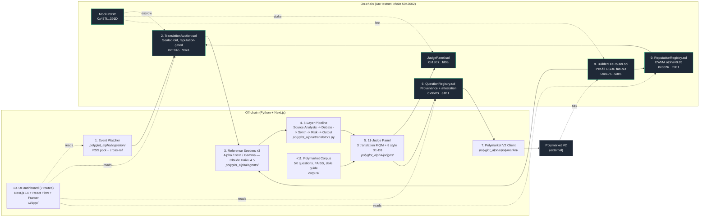
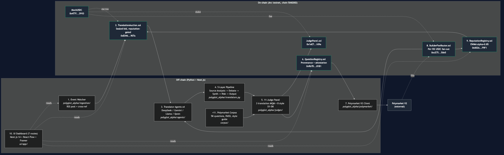
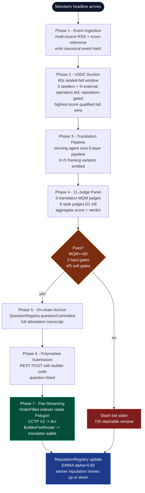
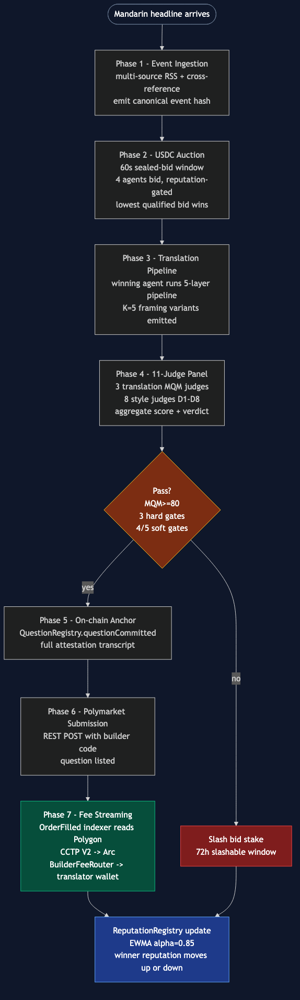
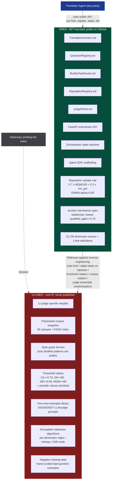
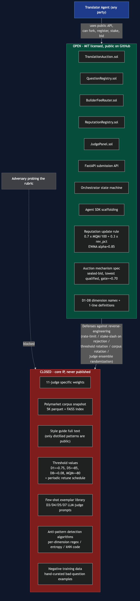
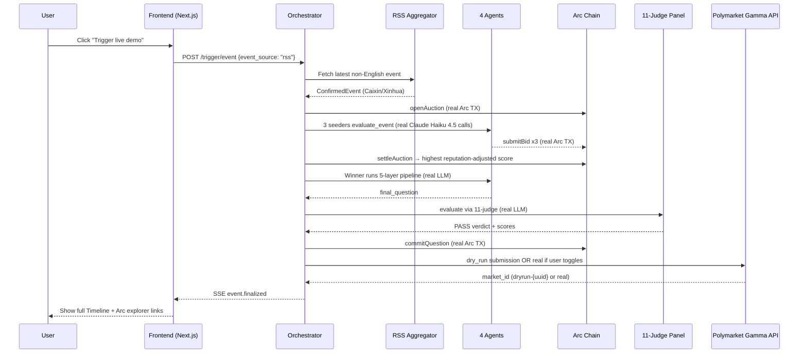
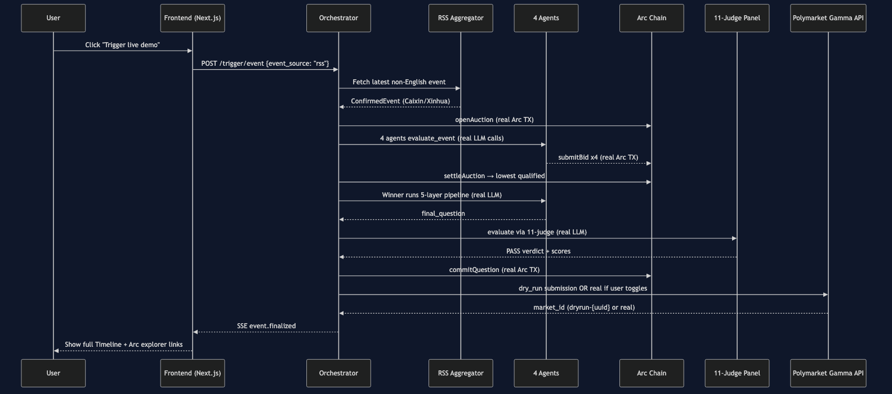

# Architecture

Four Mermaid diagrams that render on GitHub. Together they cover the static component graph, the runtime phase lifecycle, the open/closed IP boundary, and the Phase 1 ship-state real data flow.

## 1. The 10+1 components

Reading the graph
- Green outlined nodes are deployed Arc-testnet contracts (all six contracts deployed and hardened with `ReentrancyGuard` after the Phase 1 audit).
- Grey is external (Polymarket V2).
- Dashed edges are reads/observations; solid edges are writes.

## 2. Phase lifecycle (one event, end-to-end)

Phase 4 hard gates: D1 (structural), D5 (resolution clarity), D8 (duplicate), aggregate MQM ≥ 80. Soft gates: ≥ 4 of 5 from {D2, D3, D4, D6, D7}. See repo `README.md` "Mechanism design defaults" and thesis §5.22.

## 3. Open / closed IP boundary

Pattern reference: Moody's / S&P / FICO / Google search / ETS — publish the rating-scale concept, keep the specific weights private. Full rationale in thesis §5.27 (information-disclosure paradox) and §5.28 (Hayek tacit-knowledge argument).

## 4. Phase 1 ship-state — real data flow (post-§5.48)

Sequence diagram of one "Trigger live demo" click, mapping the real on-chain and off-chain calls that fire during the 60-second wall-clock lifecycle. Compare to diagram 2 for the abstract phase model; this one shows actual service-to-service edges in the Phase 1 ship state.

What this diagram shows that diagram 2 does not
- The `event_source: "rss"` flag — Phase 1 ships with real RSS aggregation as the default path; mock-event injection is a debug-only fallback.
- Real Arc transactions on every `openAuction`, `submitBid`, `settleAuction`, and `commitQuestion` call — verifiable on `https://testnet.arcscan.app` against the addresses in the README.
- 11-judge panel runs real LLM calls (not stub scores) — `PASS` verdict requires aggregate MQM ≥ 80 plus the three hard gates per §5.22.
- Polymarket Gamma API submission defaults to `dry_run`; user must explicitly toggle "Submit Real" in the UI to flip to a production submission, gated by the §5.43 rate limit + idempotency + quality gate.
- SSE channel pushes phase transitions to the UI in real time — no polling; the 60-second wall-clock is observed, not simulated.

## 5. Quick-reference: file layout to component map

| Component         | Primary source path                                          |
|-------------------|--------------------------------------------------------------|
| 1. Event Watcher  | `polyglot_alpha/ingestion/`                                  |
| 2. Auction        | `contracts/src/TranslationAuction.sol`                       |
| 3. Agents         | `polyglot_alpha/agents/{gemini,deepseek,qwen}_agent.py` (3 files; classes aliased to `SeederAlpha`/`SeederBeta`/`SeederGamma`; all back on Claude Haiku 4.5) |
| 4. Pipeline       | `polyglot_alpha/translators.py`, `synthesizer.py`, `analysts.py` |
| 5. Judges         | `polyglot_alpha/judges/translation/`, `polyglot_alpha/judges/style_alignment/`, `polyglot_alpha/judges/panel.py` |
| 6. QuestionRegistry | `contracts/src/QuestionRegistry.sol`                       |
| 7. Polymarket client | `polyglot_alpha/polymarket/client.py`, `mock_client.py`   |
| 8. BuilderFeeRouter | `contracts/src/BuilderFeeRouter.sol`                       |
| 9. ReputationRegistry | `contracts/src/ReputationRegistry.sol`                   |
| 10. UI            | `ui/app/`                                                    |
| +11. Corpus       | `corpus/`, `polyglot_alpha/corpus/`                          |
| Orchestrator      | `polyglot_alpha/orchestrator.py`                             |
| API               | `polyglot_alpha/api/main.py`                                 |
